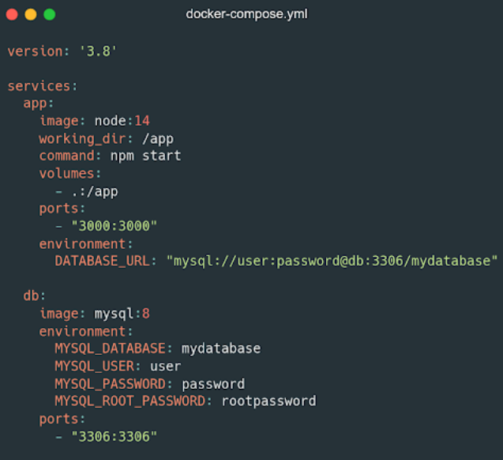
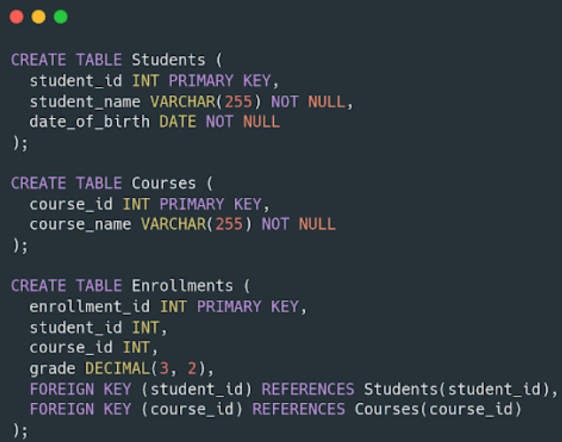
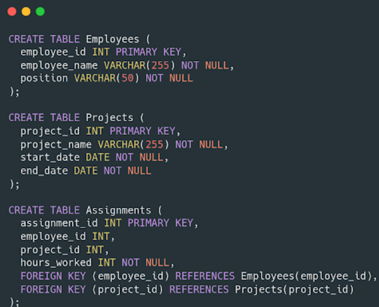

1. What is the role of npm in Node JS application development?
    a. Handling HTTP request
    b. Managing Typescript dependencies
    c. Managing dependencies and packages
    d. Install node_modules

2. How do you create a GET route endpoint in Express JS following proper REST conventions? (ex: for fetching a collection of products).
    a. app.get('/products', callback)
    b. app.get('/get-products', callback)
    c. app.get('/product, callback)
    d. app.get('/get-product, callback)

3. What is the difference between PUT and POST in the context of REST API?
    a. PUT is used to update data, while POST is used to create new data
    b. PUT and POST can both be used to update data
    c. PUT and POST can both be used to create new data
    d. PUT is used to create new data, while POST is used to update data

4. How do you configure middleware in Express JS? assuming app is the variable declared for express
    a. app.configure(middlewareFunction)
    b. middlewareFunction.configure(app)
    c. middlewareFunction.use(app)
    d. app.use(middlewareFunction)

5. What is middleware in Express JS and how can you implement it to validate input data before saving it to the database?
    a. Middleware is used only to connect Express JS application with the database server
    b. Middleware can only be used for user session management
    c. Middleware is the standard method for managing routes in Express JS
    d. Middleware is a function that can modify the request or response object

6. The following is not for handling user authentication in REST API developemnt:
    a. Basic Authentication
    b. JSON Web Token (JWT)
    c. OAuth4.0
    d. Bearer Token

7. How can you optimize the performance of a node js application handling high HTTP traffic?
    a. Use caching for frequently used query results and consider using a reverse proxy
    b. Increase the use of synchronous programming to ensure data consistency, and use monitoring tools to detect bottlenecks
    c. Avoid using clustering as it can cause unnecessary overhead and focus on optimizing the source code
    d. Use serverless computing techniques to manage high traffic loads and ensure application availability

8. Explain the concept of JWT (JSON Web Token) and how it is used in authentication and authorization in node js application
    a. JWT is an authentication mechanism that provides authentication workflow within the server. Its usage involves storing tokens in cookies on both the server and the user client
    b. JWT is and authorization protocol used to verify user identity. Its usage involves exchanging tokens between the server and the user
    c. JWT can only be used for authentication, and cannot be used for authorization. Its usage involves exchanging tokens between the server and the client
    d. JWT is a structured token format that can be used to transmit user information. Its usage involves creating tokens and verifying them on each request

9. Explain the difference between authentication and authorization in the context of creating REST API
    a. Authentication and authorization are concepts used to store data in cache on the server
    b. Authentication is the process of verifying users identity, while authorization is the process of granting access rights based on the verified identity
    c. Authentication and authorization are terms that can be used interchangeable because they have similar meanings
    d. All answer is correct

10. How to create a new table with the condition of two columns where the first column is used to store numbers and the second column is used to store a name in MySQL?
    a. CREATE TABLE new_table (column1 INT, column2 VARCHAR(255));
    b. CREATE new_table (column1 INT, column2 VARCHAR(255));
    c. CREATE new_table ADD COLUMN (column1 VARCHAR(255), column2 INT);
    d. CREATE TABLE new_table (column1 VARCHAR(255), column2 INT);

11. What is meant by a Foreign Key (FK) in SQL and how do you use it?
    a. Foreign Key is used to link two tables together based on a specific column
    b. Foreign Key is used to identify unique records in a table
    c. Foreign Key is used to provide default values for certain columns
    d. Foreign Key is used to sort data in a table based on a specific column

12. How do you delete all data from a table in MySQL without deleting the table structure itself?
    a. DELETE * FROM table_name;
    b. REMOVE FROM table_name;
    c. TRUNCATE table_name;
    d. DROP table_name;

13. Explain the concept of normalization in the database design and why it is important?
    a. Normalization is the process of reducing redundancy and data dependencies in a database. It is important to ensure consistent data and reduce the risk of anomalies
    b. Normalization is the process of grouping data in a database based on its data type. It is important to ensure efficient data storage
    c. Normalization is the process of converting data into a simpler form. It is important to facilitate data readability in the database
    d. Normalization is not important in database design because it can increase the complexity of SQL queries

14. What is a nested subquery and how can you use it in SQL?
    a. A Nested Subquery is a subquery that is placed inside the main HAVING clause. It is used by applying aggregate functions to the result of the subquery
    b. Nested Subquery is a subquery placed inside the main SELECT clause. It is used by grouping the result of the subquery for use in the main SELECT clause
    c. Nested Subquery is a subquery placed inside the main FROM clause. It is used by referencing the result of the subquery as a temporary table in the FROM clause
    d. Nested Subquery is a subquery placed inside the main WHERE clause. It is used to filter the main results based on the criteria of the subquery

15. What is Docker Compose? How do you use it to manage complex applications?
    a. Docker Compose is a service used only to create and manage networks in Docker. It can be used to set up communication between containers
    b. Docker Compose is a command for compiling and configuring Docker Images. It can be used to build and store Docker Images
    c. Docker Compose is a web service for managing Docker containers. It can simplify the implementation and orchestration of applications consisting of multiple services
    d. Docker Compose is a tool for composing and compiling source code in Docker Applications. It can help manage the development project of an application in a structured manner

16. How does Docker manage volumes and what are their benefits in the context of data persistence?
    a. Docker uses volumes to store snapshots of containers. The benefits is to create data backups
    b. Docker uses volumes to provide persistent storage outside of the container. The benefit is to maintain and share data among containers
    c. Docker uses volumes to enchance data security within the container. The benefit is to protect data from unauthorized access
    d. There is no answer

17. What is meant by mocking in the context of unit testing in Express JS?
    a. Mocking is the process of creating identical data copies for testing purposes
    b. Mocking is a step in the optimization process of Express JS to improve server response time
    c. Mocking is a technique to replace external components with fake implementations to isolate the unit being tested
    d. Mocking is the process of creating a replica of an Express JS server to replace the original server during unit testing

18. What is the difference between beforeEach and before in unit testing with Jest in Express JS?
    a. beforeEach is used to configure the setup before each test, while before is used to configure the setup after each test
    b. beforeEach and before are the same, so they can be used interchangeably
    c. beforeEach is used to run a block of code before each test is executed, while before runs the code block only once before all tests are executed
    d. before is used to run a block of code before each test is executed, while beforeEach runs the code block only once before all tests are executed

19. If we successfully add a new record to our database, which HTTP response code is most appropriate to use? If we do not have proper access to access a request, what response code should be provided?
    a. 200 & 404
    b. 200 & 401
    c. 201 & 404
    d. 201 & 401

20. Consider the TypeScript code above that uses Express JS for routing and middleware. What does the loggerMiddleware function do in this Express JS application?

/*
    const middlewareLog = (req: Request, res: Response, next: NextFunction) => {
        console.log(`[${new Date().toISOString()}] - ${req.method} ${req.url}`)
    }
*/

    a. logs the timestamp, HTTP method, and URL of every outgoing response to the console
    b. logs the timestamp, HTTP method, and URL of every incoming request to the console
    c. logs the timestamp, HTTP method, and URL of every incoming request to a file
    d. handles authentication for protected routes using middleware

21. Consider the following Typescript code that uses Express JS, Typescript, and Prisma to fetch data from the products and reviews tables. What does parseInt(req.params.id, 10); do on the line const productId = parseInt(req.params.id, 10); and what will happen if there is an error fetching data from the reviews table?))

/*
    app.get('/api/products/:id', async(req: Request, res: Response, next: NextFunction) => {
        const productId = parseInt(req.params.id, 10)

        const findProduct = prisma.product.findUnique({ where: { id: productId } })

        if(findProduct){
            const reviews = prisma.review.findMany({ where: { productId: findProduct.id } })
        }else{
            res.status(404).json({
                error: 'Product Not Found'
            })
        }
    })
*/

    a. This line converts req.params.id to an integer. If the review is not found, it will cause a runtime error and crash
    b. This line applies decimal parsing to req.params.id. If the review is not found, the server will respond with a 500 error status
    c. This line converts req.params.id to an integer. If the review is not found, the server will response with a 500 error status
    d. This line applies decimal parsing to req.params.id. If the review is not found, the server will respond with a 200 status

22. The `app` service in the docker-compose.yml file is intended for ?

    a. Service for managing Nginx proxy
    b. Service for creating images in Docker
    c. Service for running Node JS applications
    d. Service for creating a network in Docker

23. Based on the three tables, select the answer below to get the names of students who have scores above the average for all courses taken?

    a. SELECT DISTINCT s.student_name FROM Students s INNER JOIN Enrollments e ON s.student_id = e.student_id INNER JOIN Courses c ON e.course_id = c.course_id WHERE e.grade > (SELECT AVG(grade) FROM Enrollments);
    b. SELECT s.student_name FROM Students s INNER JOIN Enrollments e ON s.student_id = e.student_id INNER JOIN Courses c ON e.course_id = c.course_id GROUP BY s.student_name WHERE AVG(e.grade) > (SELECT AVG(grade) FROM Enrollments);
    c. SELECT s.student_name FROM Students s INNER JOIN Enrollments e ON s.student_id = e.student_id INNER JOIN Courses c ON e.course_id = c.course_id WHERE e.grade > (SELECT AVG(grade) FROM Enrollments GROUP BY course_id);
    d. SELECT s.student_name FROM Students s INNER JOIN Enrollments e ON s.student_id = e.student_id INNER JOIN Courses c ON e.course_id = c.course_id WHERE e.grade > (SELECT AVG(grade) FROM Enrollments GROUP BY student_id);

24. Based on the three tables, how to display the project names, employee names, and total working hours worked by each employee on the "Web Development" project. Sort the results based on total working hours in descending order.

    a. SELECT p.project_name, e.employee_name, MAX(a.hours_worked) AS total_hours_worked FROM Projects p JOIN Assignments a ON p.project_id = a.project_id JOIN Employees e ON a.employee_id = e.employee_id WHERE p.project_name = 'Web Development' GROUP BY p.project_name, e.employee_name ORDER BY total_hours_worked DESC;
    b. SELECT p.project_name, e.employee_name, AVG(a.hours_worked) AS total_hours_worked FROM Projects p JOIN Assignments a ON p.project_id = a.project_id JOIN Employees e ON a.employee_id = e.employee_id WHERE p.project_name = 'Web Development' GROUP BY p.project_name, e.employee_name ORDER BY total_hours_worked DESC;
    c. SELECT p.project_name, e.employee_name, COUNT(a.hours_worked) AS total_hours_worked FROM Projects p JOIN Assignments a ON p.project_id = a.project_id JOIN Employees e ON a.employee_id = e.employee_id WHERE p.project_name = 'Web Development' GROUP BY p.project_name, e.employee_name ORDER BY total_hours_worked DESC;
    d. SELECT p.project_name, e.employee_name, SUM(a.hours_worked) AS total_hours_worked FROM Projects p JOIN Assignments a ON p.project_id = a.project_id JOIN Employees e ON a.employee_id = e.employee_id WHERE p.project_name = 'Web Development' GROUP BY p.project_name, e.employee_name ORDER BY total_hours_worked DESC;